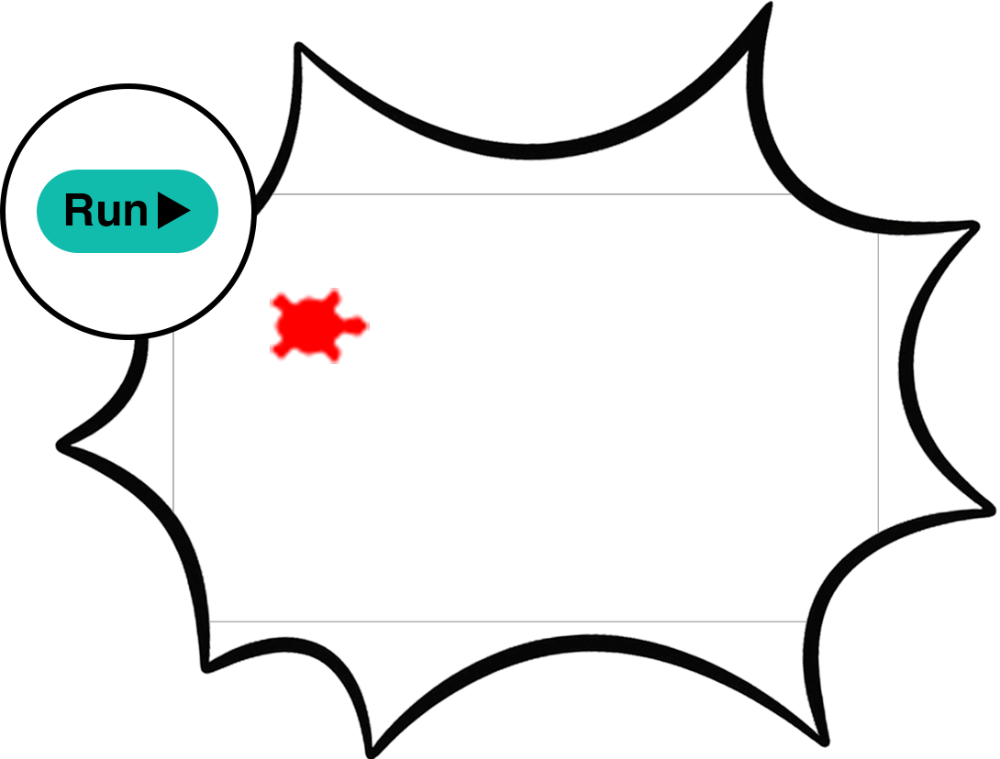
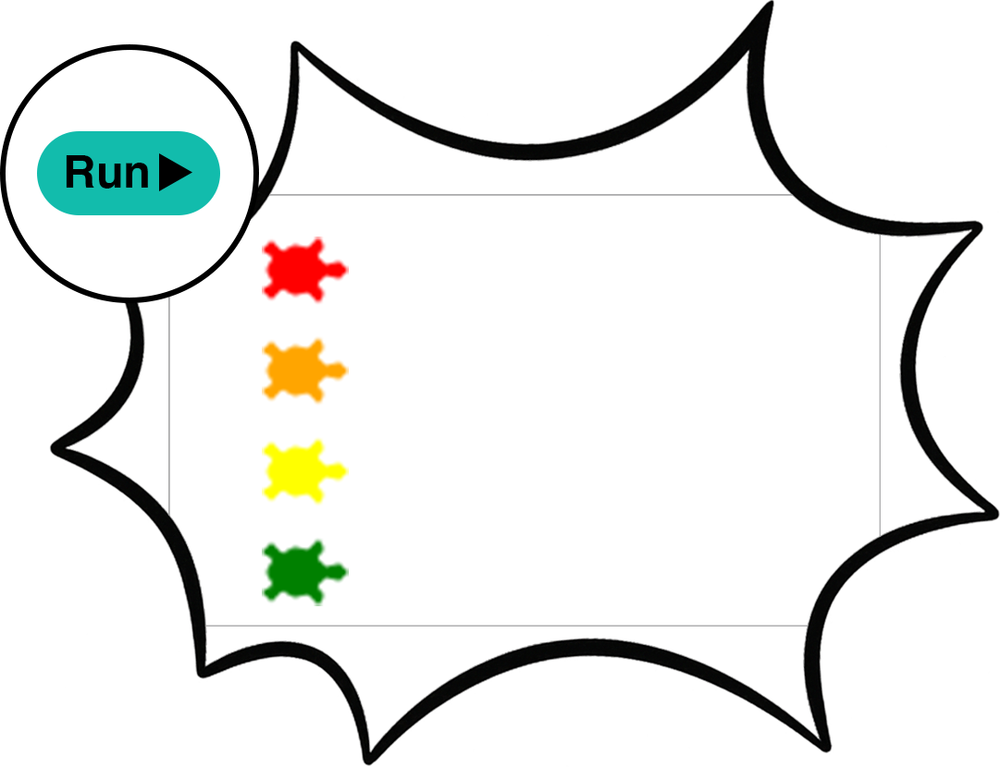

## Add your turtles

--- task ---

Open the [Turtle race starter](https://editor.raspberrypi.org/en/projects/turtle-race-starter){:target="_blank"} project.

--- /task ---

--- task ---

Import `turtle` to draw and `randint` so the turtles move at different speeds.

--- code ---
---
language: python
filename: main.py
line_numbers: true
line_number_start: 1
line_highlights: 1, 3
---
from turtle import *
from random import randint
--- /code ---

--- /task ---

--- task ---

Make your first turtle. Pick a name and colour. Move it to the start.

--- code ---
---
language: python
filename: main.py
line_numbers: true
line_number_start: 4
line_highlights:
---
ada = Turtle()
ada.color('red')
ada.shape('turtle')
ada.penup()
ada.goto(-160, 100)
ada.pendown()
--- /code ---

--- /task ---

--- task ---

Click Run to see your turtle.

--- /task ---

--- task ---

Copy the code three times. Change the name, colour, and `y` position for each turtle.

--- code ---
---
language: python
filename: main.py
line_numbers: true
line_number_start: 11
line_highlights: 12, 15, 19, 22, 26, 29
---
bob = Turtle()
bob.color('orange')
bob.shape('turtle')
bob.penup()
bob.goto(-160, 70)
bob.pendown()

eve = Turtle()
eve.color('yellow')
eve.shape('turtle')
eve.penup()
eve.goto(-160, 40)
eve.pendown()

kai = Turtle()
kai.color('green')
kai.shape('turtle')
kai.penup()
kai.goto(-160, 10)
kai.pendown()
--- /code ---

--- /task ---

--- task ---

--- /task ---
