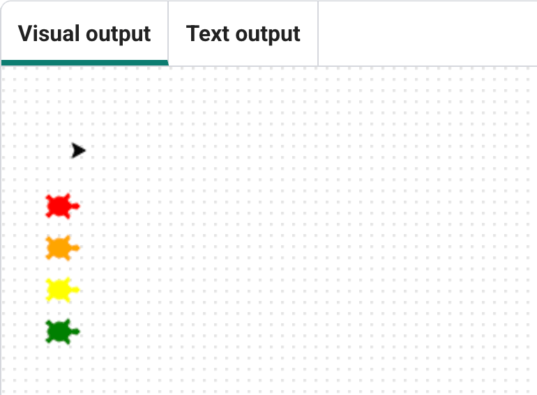
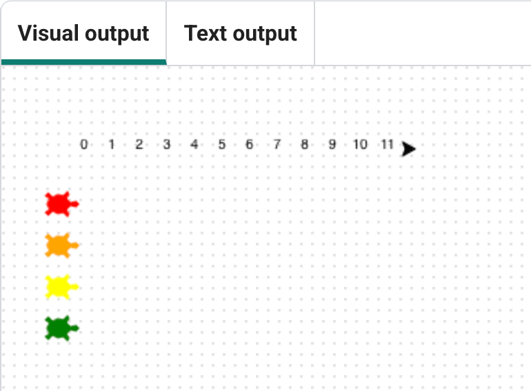
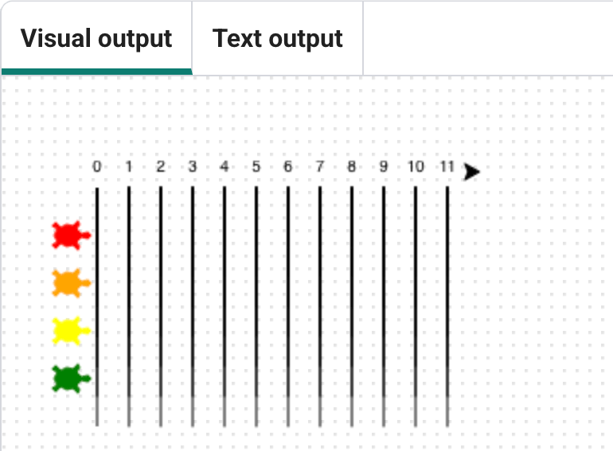

## Add a track

--- no-print ---

<!-- Video wrapper keeps 16:9 and full width -->

<iframe
    src="https://www.youtube.com/embed/Mnaho5jdJSc?si=2RLQWZ26loCLYt8C"
    style="position: absolute; inset: 0; width: 100%; height: 100%; border: none;"
    allowfullscreen>
</iframe>

 

Play, pause, make. Follow the project on our [YouTube](4) playlist!

--- /no-print ---

--- task ---

Move the pen to the top left and make it draw fast.

--- code ---
---
language: python
filename: main.py
line_numbers: true
line_number_start: 32
line_highlights: 
---
penup()
goto(-140, 140)
speed(10)
--- /code ---

--- /task ---

--- task ---

Write numbers from `0` to `11` across the top.

--- code ---
---
language: python
filename: main.py
line_numbers: true
line_number_start: 36
line_highlights: 
---
for step in range(12):
    write(step, align='center')
    forward(20)
--- /code ---
--- /task ---

--- task ---

Try changing the `12` to see what happens.

--- /task ---

--- task ---

Draw lines under each number to make lanes.

--- code ---
---
language: python
filename: main.py
line_numbers: true
line_number_start: 36
line_highlights: 38-44
---
for step in range(12):
   write(step, align='center')
   right(90)
   forward(10)
   pendown()
   forward(150)
   penup()
   backward(160)
   left(90)
   forward(20)
--- /code ---

--- /task ---

