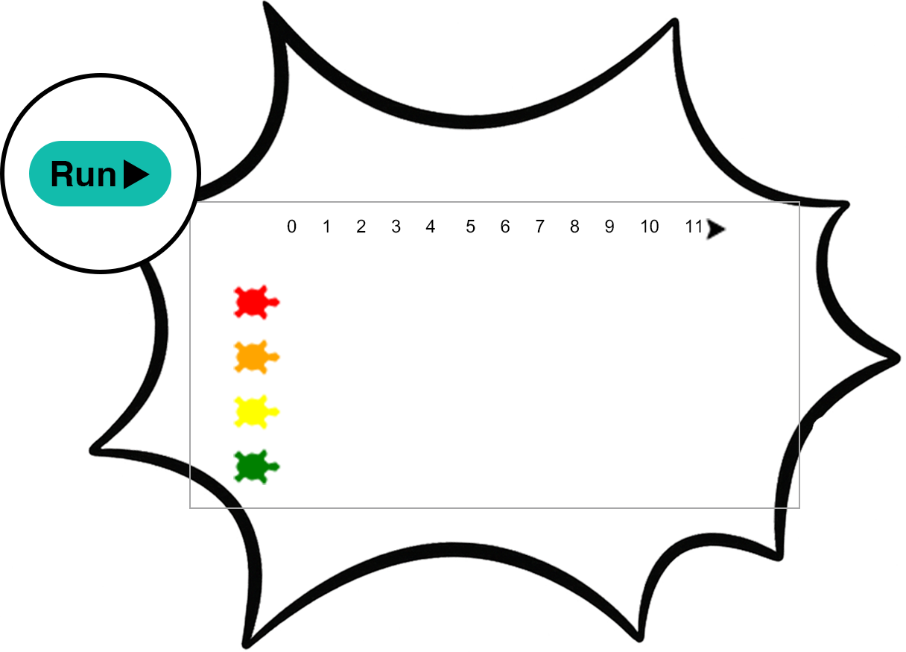
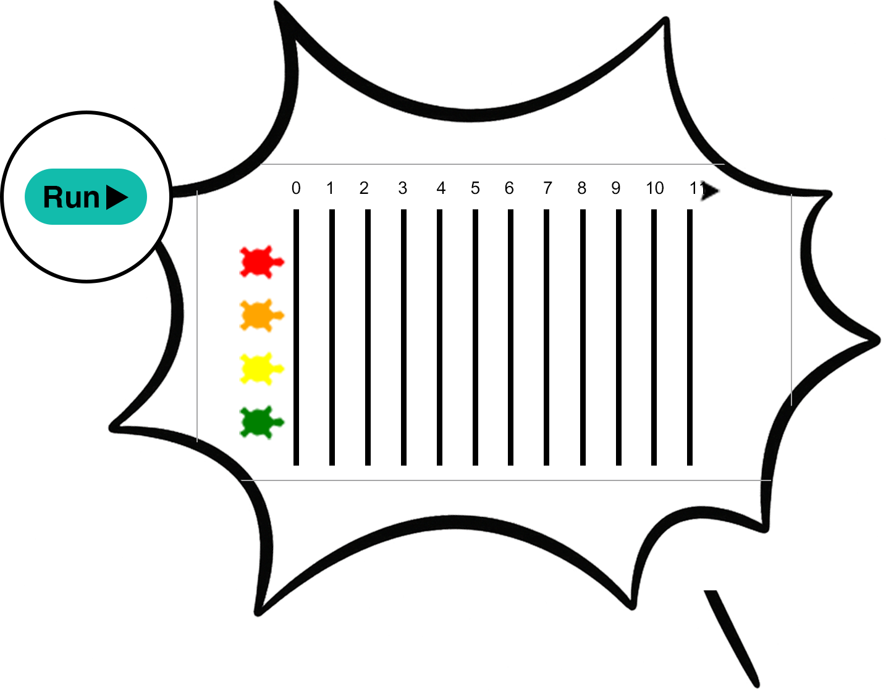

## Add a track

--- task ---

Move the pen to the top left and make it draw fast.

--- code ---
---
language: python
filename: main.py
line_numbers: true
line_number_start: 32
line_highlights: 
---
penup()
goto(-140, 140)
speed(10)
--- /code ---

--- /task ---

--- task ---

Write numbers from `0` to `11` across the top.

--- code ---
---
language: python
filename: main.py
line_numbers: true
line_number_start: 36
line_highlights: 
---
for step in range(12):
    write(step, align='center')
    forward(20)
--- /code ---
--- /task ---

--- task ---

Try changing the `12` to see what happens.

--- /task ---

--- task ---

Draw lines under each number to make lanes.

--- code ---
---
language: python
filename: main.py
line_numbers: true
line_number_start: 36
line_highlights: 38-44
---
for step in range(12):
   write(step, align='center')
    right(90)
    forward(10)
    pendown()
    forward(150)
    penup()
    backward(160)
    left(90)
    forward(20)
--- /code ---

--- /task ---

