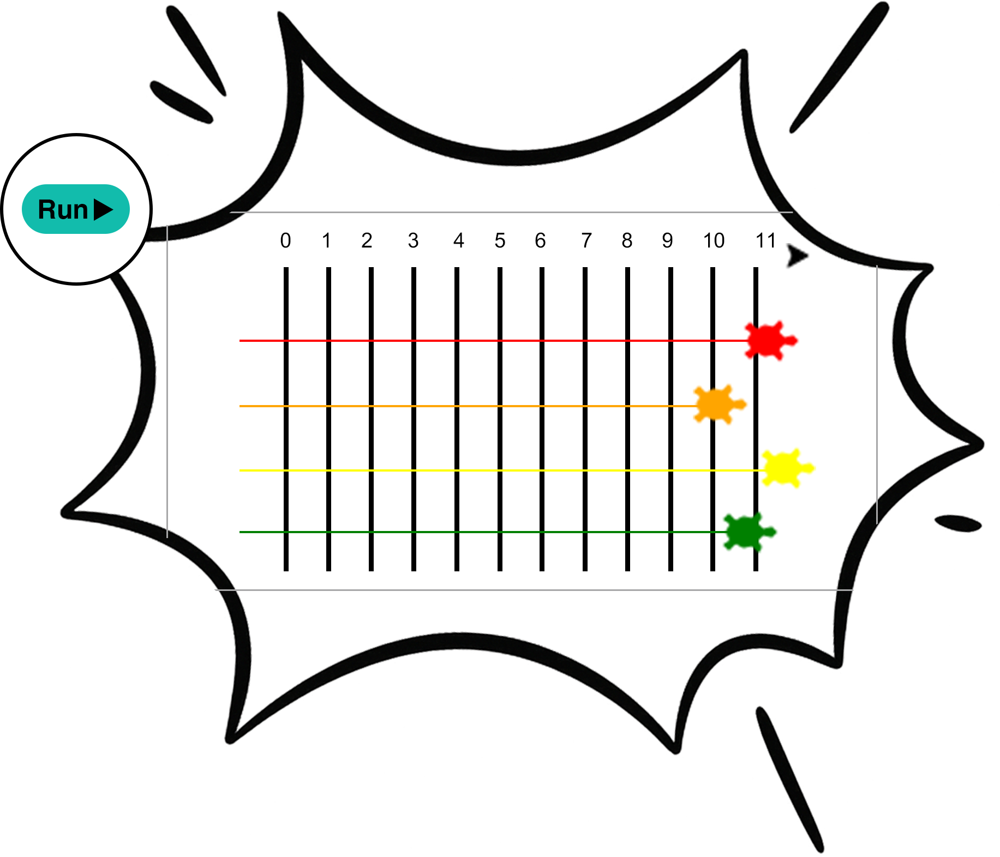

## Race the turtles

--- no-print ---

<!-- Video wrapper keeps 16:9 and full width -->

<iframe
    src="https://www.youtube.com/embed/zMn4hSSO9wU?si=oJ3s6RoEqEaOhbga"
    style="position: absolute; inset: 0; width: 100%; height: 100%; border: none;"
    allowfullscreen>
</iframe>

 
--- /no-print ---

--- task ---

Make the first turtle move forward a random distance, 100 times.

--- code ---
---
language: python
filename: main.py
line_numbers: true
line_number_start: 47
line_highlights: 
---
for turn in range(100):
    ada.forward(randint(1, 5))
--- /code ---

--- /task ---

--- task ---

Now add the other turtles to the race.

--- code ---
---
language: python
filename: main.py
line_numbers: true
line_number_start: 49-51
line_highlights: 
---
for turn in range(100):
    ada.forward(randint(1, 5))
    bob.forward(randint(1, 5))
    eve.forward(randint(1, 5))
    kai.forward(randint(1, 5))
--- /code ---

--- /task ---

--- task ---

Try changing the numbers in `randint(1, 5)` and `range(100)` to see what happens.

--- /task ---

--- no-print ---

<!-- Video wrapper keeps 16:9 and full width -->

<iframe
    src="https://www.youtube.com/embed/videoseries?si=aeY_2SYOhetzn3De&amp;list=PLeumwG3_SvUsxO1RQdoeX29ak4qLvTMYd"
    style="position: absolute; inset: 0; width: 100%; height: 100%; border: none;"
    allowfullscreen>
</iframe>

--- /no-print ---